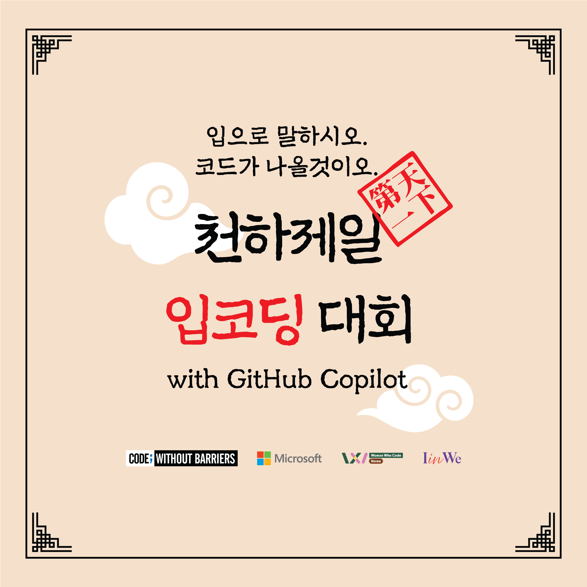

# 천하제일 입코딩 대회 2025

  

  
<strong>제 1회 천하제일 입코딩대회에 오신 것을 환영합니다!</strong>

## 행사 정보

자세한 행사 정보는 [https://lipcoding.kr](https://lipcoding.kr) 페이지를 참고하세요.

## 대회 방식

- 제한시간: 3시간
- 사용 도구: VS Code + GitHub Copilot 보이스 코딩
- 기술 스택: 웹 앱
- 사용 언어: Python 3.12, JavaScript (node.js LTS 22.x), Java 21, .NET 9 중 선택
- 데이터베이스: 메모리 DB 또는 SQLite

## 시간 계획

| 시간          | 내용                              |
|---------------|-----------------------------------|
| 12:00 - 12:30 | 체크인                            |
| 12:30 - 12:35 | 오프닝                            |
| 12:35 - 13:05 | 오프닝 키노트                     |
| 13:05 - 13:20 | GitHub Copilot 사용법 안내        |
| 13:20 - 13:30 | 행사 진행 안내                    |
| 13:30 - 14:00 | 입코딩 전 사전 준비 (키보드 허용) |
| 14:00 - 17:00 | 입코딩                            |
| 17:00 - 17:30 | 본선 진출자 투표                  |
| 17:30 - 18:00 | 시상 및 클로징                    |

## 도전 과제

**웹 기반 멘토-멘티 매칭 앱 만들기**

- [요구사항](./mentor-mentee-app-requirements.md)
- [사용자 스토리](./mentor-mentee-app-user-stories.md)
- [API 명세](./mentor-mentee-api-spec.md)
- [평가 방식](./mentor-mentee-app-assessment.md)

## 앱 제출

<strong>앱 제출 마감 기한: 2025년 6월 28일 17시</strong>

     

앱 개발을 마친 참가자는 을 클릭해서 자신이 완성한 앱의 리포지토리와 관련 정보를 등록합니다. 이후 GitHub Actions 워크플로우를 통해 이슈에 등록한 내용을 바탕으로 평가를 진행합니다.

> **참고**: 이 때 최종 제출 시각을 넘겨서 제출한 참가자는 자동으로 탈락합니다. 최종 제출 시각은 **2025년 6월 28일 17시**입니다.

## 본선 진출자 명단

| 이름 | GitHub ID | 리포지토리 주소 | 동영상 주소 | 제출 시각 |
|------|-----------|-----------------|-------------|-----------|
