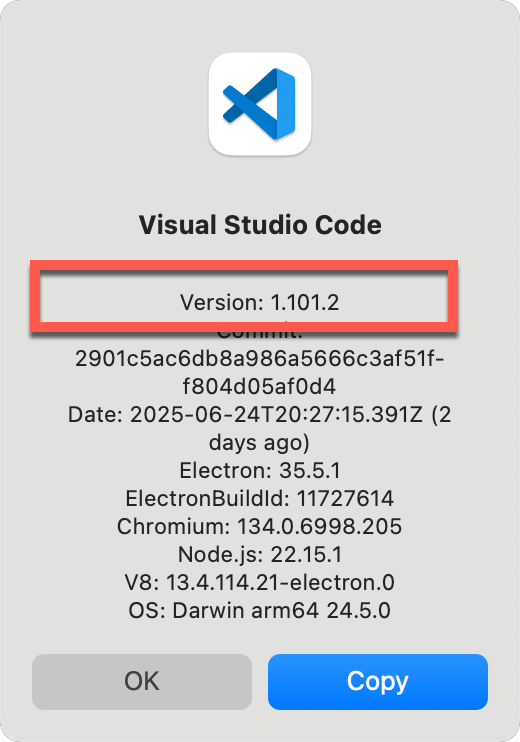
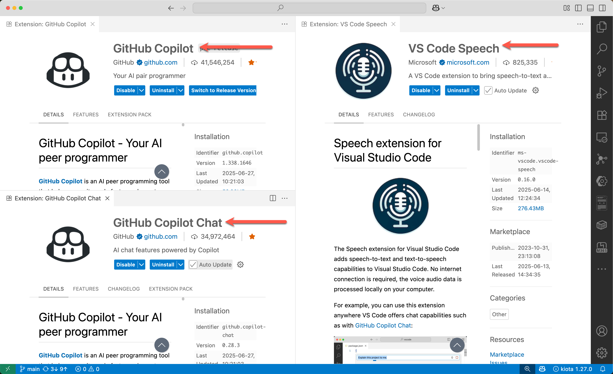
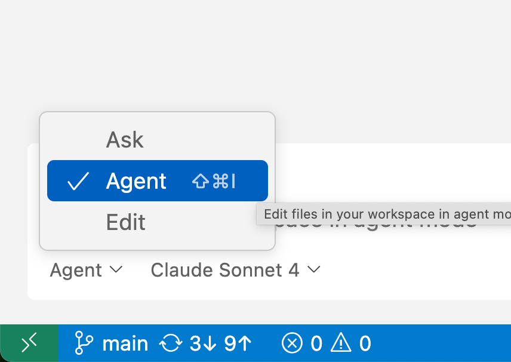
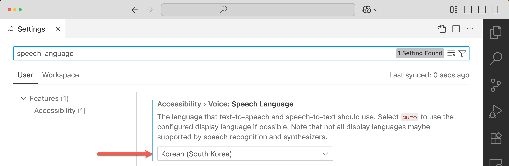
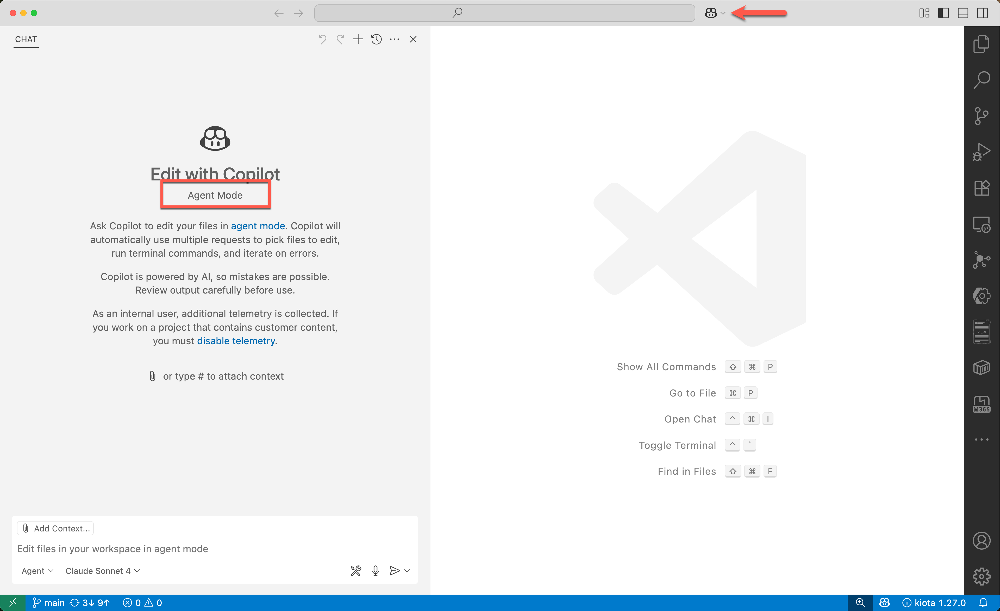
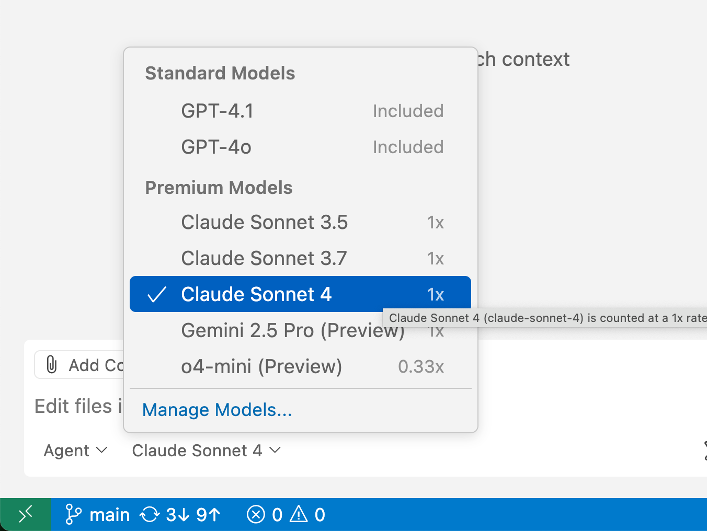

# GitHub Copilot 사용법

## VS Code 버전 확인

최신 버전의 [VS Code](https://code.visualstudio.com/download)로 업데이트하세요!

## GitHub Copilot 익스텐션 설치

GitHub Copilot 관련 익스텐션을 설치하세요!

- [GitHub Copilot](https://marketplace.visualstudio.com/items?itemName=GitHub.copilot)
- [GitHub Copilot Chat](https://marketplace.visualstudio.com/items?itemName=GitHub.copilot-chat)
- [VS Code Speech](https://marketplace.visualstudio.com/items?itemName=ms-vscode.vscode-speech)

## GitHub Copilot 활성화

VS Code 설정에서 GitHub Copilot 에이전트 모드가 활성화 되어 있는지 확인하세요! 기본값으로 활성화가 되어 있지만 다시 한 번 확인하세요!

VS Code 설정에서 음성 인식 기능에 한국어로 설정되어 있는지 확인하세요! 기본값은 `auto`이지만 `Korean (South Korea)`로 강제 설정하면 좀 더 인식률이 높아집니다.

## GitHub Copilot 에이전트 모드 확인

GitHub Copilot 아이콘을 클릭해서 GitHub Copilot 에이전트 창을 열어보세요.

GitHub Copilot 에이전트 모드를 선택하세요.

생성형 AI 모델은 `GPT-4.1` 또는 `Claude Sonnet 4`를 선택하세요.

필요한 경우 [GitHub Copilot](https://github.com/settings/copilot/features) 메뉴에서 무료 기능 활성화를 시킬 수 있습니다. 만약 무료 기능 활성화를 했는데도 문제가 생긴다면 한달짜리 Pro 버전 무료 트라이얼을 활성화 시킬 수도 있습니다.

## MCP 서버 설정

필요한 경우 다양한 MCP 서버를 추가할 수 있습니다. `F1` 👉 `MCP: Add Server...` 메뉴를 선택해서 필요한 MCP 서버를 연동하세요. 더 자세한 내용은 [Use MCP servers in VS Code](https://code.visualstudio.com/docs/copilot/chat/mcp-servers) 문서를 참조하세요.

## 커스텀 지시사항 설정

필요한 경우 GitHub Copilot이 좀 더 똑똑하게 일할 수 있도록 커스텀 지시사항(Custom Instructions)을 설정할 수 있습니다. `.github` 디렉토리 밑에 `copilot-instructions.md` 파일을 생성하고 거기에 커스텀 지시사항을 저장해 두세요. 더 자세한 내용은 [Customize AI responses in VS Code](https://code.visualstudio.com/docs/copilot/copilot-customization) 문서를 참조하세요.
